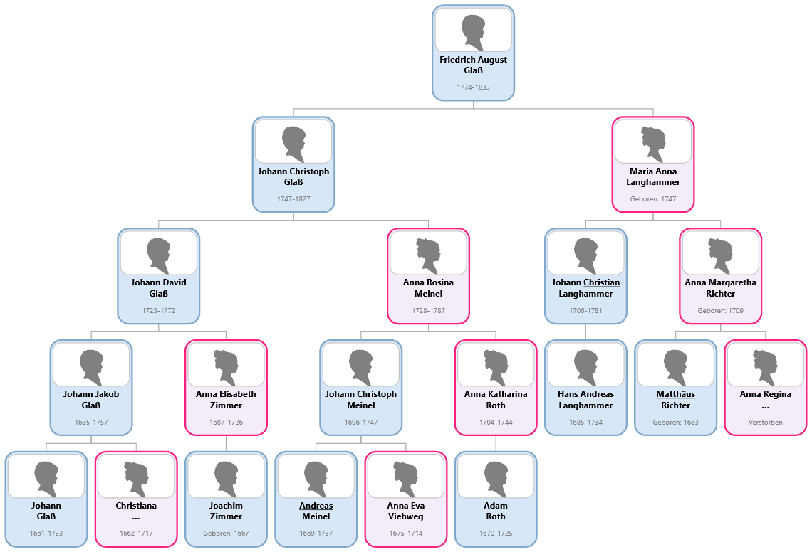
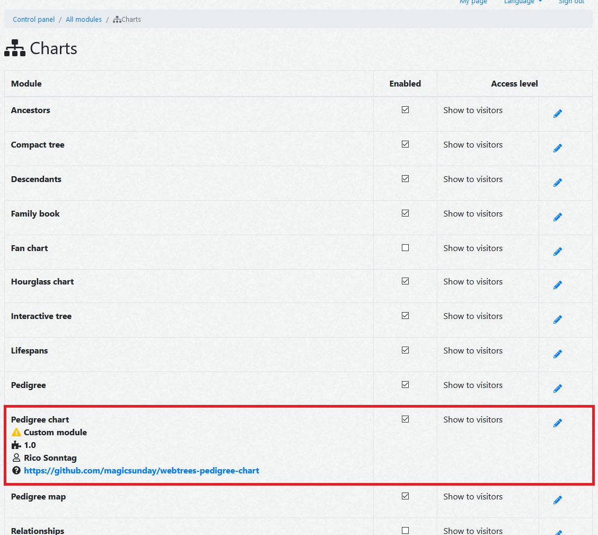

# Pedigree chart
This module provides an SVG pedigree chart for the [webtrees](https://www.webtrees.net) genealogy application. It 
is capable to display up to 25 ancestor generations of an individual.


*Fig. 1: A five generations pedigree chart (drawn top to bottom)*


*Fig. 2: A five generations pedigree chart (drawn left to right)*

**Caution: If you are rendering a lot of generations it may take a while and even slow down your system.**

## Installation
Requires webtrees 2.1.

### Using Composer
To install using [composer](https://getcomposer.org/), just run the following command from the command line 
at the root directory of your webtrees installation.

``` 
composer require magicsunday/webtrees-pedigree-chart --update-no-dev
```

The module will automatically install into the ``modules_v4`` directory of your webtrees installation.

To remove the module run:
```
composer remove magicsunday/webtrees-pedigree-chart --update-no-dev
```

### Using Git
If you are using ``git``, you could also clone the current master branch directly into your ``modules_v4`` directory 
by calling:

```
git clone https://github.com/magicsunday/webtrees-pedigree-chart.git modules_v4/webtrees-pedigree-chart
```

### Manual installation
To manually install the module, perform the following steps:

1. Download the [latest release](https://github.com/magicsunday/webtrees-pedigree-chart/releases/latest).
2. Upload the downloaded file to your web server.
3. Unzip the package into your ``modules_v4`` directory.
4. Rename the folder to ``webtrees-pedigree-chart``


## Enable module
Go to the control panel (admin section) of your installation and scroll down to the ``Modules`` section. Click
on ``Charts`` (in subsection Genealogy). Enable the ``Pedigree chart`` custom module (optionally disable the original
installed pedigree chart module) and save your settings.


*Fig. 3: Control panel - Module administration*


## Usage
At the charts' menu, you will find a new link called `Pedigree chart`. Use the provided configuration options
to adjust the layout of the charts according to your needs.


## Development
To build/update the javascript, run the following commands:

```
npm install --unsafe-perm --save-dev
npm run prepare
```

### Run tests
```
composer update
vendor/bin/phpstan analyse -c phpstan.neon
vendor/bin/phpcs src/ --standard=PSR12
```
