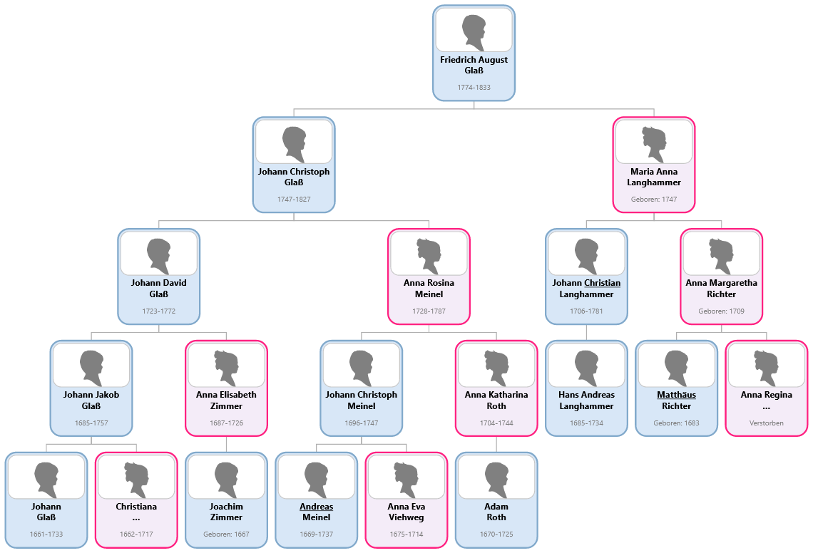
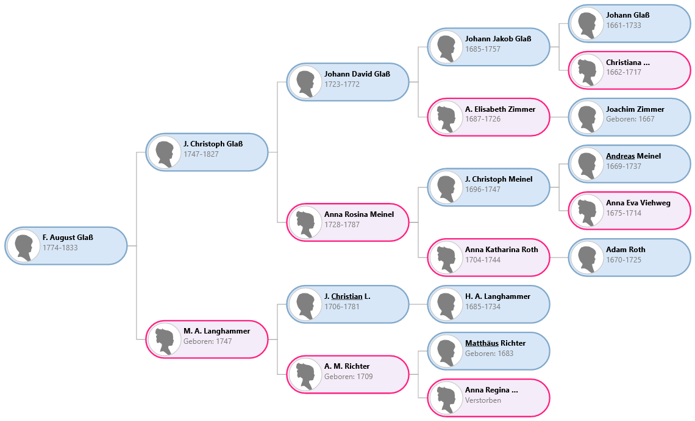
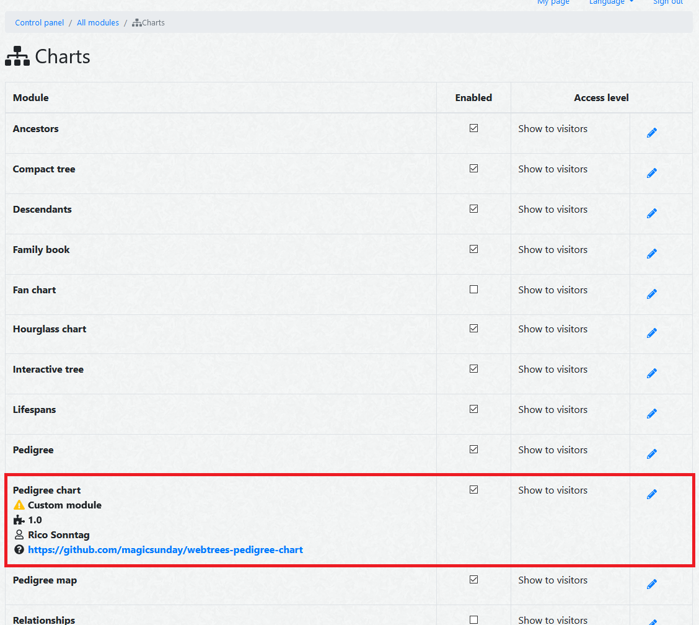

[](https://github.com/magicsunday/webtrees-pedigree-chart/releases/latest)
[](https://github.com/magicsunday/webtrees-pedigree-chart/blob/main/LICENSE)
[](https://github.com/magicsunday/webtrees-pedigree-chart/actions/workflows/ci.yml)


<!-- TOC -->
* [Pedigree chart](#pedigree-chart)
  * [Installation](#installation)
    * [Manual installation](#manual-installation)
    * [Using Composer](#using-composer)
      * [Latest version](#latest-version)
    * [Using Git](#using-git)
  * [Update](#update)
  * [Configuration](#configuration)
  * [Usage](#usage)
  * [Troubleshooting](#troubleshooting)
  * [Development](#development)
    * [Run tests](#run-tests)
<!-- TOC -->


# Pedigree chart
This module provides an SVG pedigree chart for the [webtrees](https://www.webtrees.net) genealogy application.
It is capable of displaying up to 25 generations of ancestors from an individual.

**But beware, if you select too many generations, it may take a while and even slow down your system significantly.**


*Fig. 1: A five-generations pedigree chart (drawn top to bottom)*


*Fig. 2: A five-generations pedigree chart (drawn left to right)*


## Installation
Requires webtrees 2.2.

There are several ways to install the module. The method using [composer](#using-composer) is suitable
for experienced users, as a developer you can also use [git](#using-git) to get a copy of the repository. For all other users,
however, manual installation is recommended.

### Manual installation

> [!IMPORTANT]
> **Download the right `.zip` file.** Each [GitHub release](https://github.com/magicsunday/webtrees-pedigree-chart/releases/latest) page lists two kinds of archive:
>
> - ✅ **`webtrees-pedigree-chart.zip`** — listed under **Assets** at the bottom of the release. This is the install-ready archive: it bundles the required `vendor/` dependencies (such as `webtrees-module-base`).
> - ❌ **"Source code (zip)" / `webtrees-pedigree-chart-<version>.zip`** — auto-generated by GitHub from the tag. This is the raw source *without* bundled dependencies. Uploading it to `modules_v4/` will fail with `Interface "MagicSunday\Webtrees\ModuleBase\…" not found` (or `ModuleAssetUrlInterface not found`).
>
> **Always pick the asset zip, never "Source code (zip)".**

> [!IMPORTANT]
> **If a previous version of this module is already installed:** delete the entire `modules_v4/webtrees-pedigree-chart` folder *before* extracting the new ZIP. Extracting on top of an existing folder leaves stale files behind that can clash with the new release — a common cause of `Interface … not found` errors right after an update.

To manually install the module, perform the following steps:

1. Open the [latest release](https://github.com/magicsunday/webtrees-pedigree-chart/releases/latest) page.
2. Under **Assets**, download `webtrees-pedigree-chart.zip`.
3. Upload the `.zip` file to your web server.
4. Unzip the package into your ``modules_v4`` directory.
5. Rename the folder to ``webtrees-pedigree-chart``.

If everything was successful, you should see a subdirectory ``webtrees-pedigree-chart`` with the unpacked content
in the ``modules_v4`` directory.

Then follow the steps described in [configuration](#configuration) and [usage](#usage).


### Using Composer
Typically, to install with [composer](https://getcomposer.org/), just run the following command from the command line,
from the root of your Webtrees installation.

```shell
composer require magicsunday/webtrees-pedigree-chart --update-no-dev
```

The module will automatically install into the ``modules_v4`` directory of your webtrees installation.

To remove the module run:
```shell
composer remove magicsunday/webtrees-pedigree-chart --update-no-dev
```

Then follow the steps described in [configuration](#configuration) and [usage](#usage).

#### Latest version
If you are using the development version of Webtrees (main branch), you may also need to install the development
version of the module. For this, please use the following command:
```shell
composer require magicsunday/webtrees-pedigree-chart:dev-main --update-no-dev
```


### Using Git
If you are using ``git``, you could also clone the current main branch directly into your ``modules_v4`` directory 
by calling:

```shell
git clone https://github.com/magicsunday/webtrees-pedigree-chart.git modules_v4/webtrees-pedigree-chart
```

A Git checkout contains the source code only — it does **not** include the bundled
`vendor/` dependencies. After cloning, install them from inside the module directory
(this requires [Composer](https://getcomposer.org/) and a PHP CLI on the host):

```shell
cd modules_v4/webtrees-pedigree-chart
composer install --no-dev
```

> [!IMPORTANT]
> Without this step the module aborts on every page with a
> `Trait "MagicSunday\Webtrees\ModuleBase\…" not found` fatal error, because the
> shared `webtrees-module-base` dependency is missing from `vendor/`. If you cannot
> run Composer on your server, use the [asset zip](#manual-installation) instead.

Then follow the steps described in [configuration](#configuration) and [usage](#usage).


## Update
- **Manual installation**: From the [latest release](https://github.com/magicsunday/webtrees-pedigree-chart/releases/latest) **Assets** section, download `webtrees-pedigree-chart.zip` (not "Source code (zip)"), **delete the old `modules_v4/webtrees-pedigree-chart` folder first**, and extract the new one. Extracting on top of an existing folder leaves stale files behind that can clash with the new release (a common cause of `Interface … not found` errors after an update).
- **Composer**: Run `composer update magicsunday/webtrees-pedigree-chart --update-no-dev`.
- **Git**: Run `git pull` inside the `modules_v4/webtrees-pedigree-chart` directory.


## Configuration
Go to the control panel (admin section) of your installation and scroll down to the ``Modules`` section. Click
on ``Charts`` (in subsection Genealogy). Enable the ``Pedigree chart`` custom module (optionally disable the original
installed pedigree chart module) and save your settings.


*Fig. 3: Control panel - Module administration*


## Usage
At the charts' menu, you will find a new link called `Pedigree chart`. Use the provided configuration options
to adjust the layout of the charts according to your needs.


## Troubleshooting

**Fatal error after a manual installation or update: `Interface "MagicSunday\Webtrees\ModuleBase\…" not found` (or `ModuleAssetUrlInterface not found`)**
- You probably downloaded the GitHub-generated **"Source code (zip)"** instead of the install-ready asset **`webtrees-pedigree-chart.zip`**. The asset bundles the required `vendor/` dependencies; the source zip does not. Open the [latest release](https://github.com/magicsunday/webtrees-pedigree-chart/releases/latest), scroll to **Assets**, download `webtrees-pedigree-chart.zip`, and re-extract.
- If you used the asset zip, make sure you **deleted the previous `modules_v4/webtrees-pedigree-chart` folder before extracting**. Stale files from an older version can shadow the new bundled vendor code and produce the same error.

**The chart does not appear / shows an error**
- Make sure the module is enabled in the Control Panel under Modules > Charts.
- Check that your PHP version is 8.3 or later.
- Clear your browser cache and reload the page.


## Development
To build/update the JavaScript, you can either use a local Node.js installation or Docker.

### Using Docker
No local Node.js installation required. Just run:

```shell
make install
make build
```

To watch for changes and rebuild automatically:
```shell
make watch
```

### Using local Node.js
```shell
nvm install node
npm install
npm run prepare
```

### Run tests
```shell
composer update

composer ci:test
composer ci:test:php:phpstan
composer ci:test:php:lint
composer ci:test:php:rector
```
